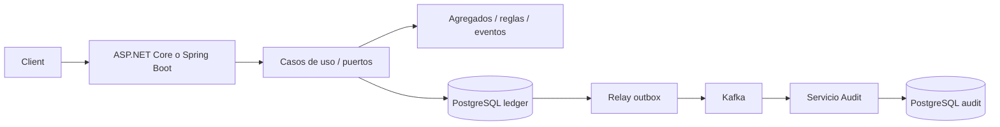

# Arquitectura y lenguaje del dominio

Cuenta: agregado monetario identificado por UUID. Transferencia: movimiento entre dos cuentas de la misma moneda. Apunte: variación firmada en unidades mínimas. Evento: hecho persistido e inmutable. Proyección: vista derivada reconstruible. Outbox: evento pendiente de entrega. Inbox: identidad de un evento ya procesado.

## Contextos acotados

Ledger controla dinero y transferencias. Onboarding controla elegibilidad de solicitudes. Risk interpreta señales sintéticas mediante plugins. Reconciliation transforma registros de un proveedor externo. Inventory controla reservas. Audit recibe eventos públicos del ledger sin consultar su almacenamiento interno.

Relaciones: Onboarding es proveedor de elegibilidad para Ledger; Ledger publica un contrato versionado a Audit (open host service/published language). Reconciliation usa una capa anticorrupción para el formato externo. Inventory no comparte agregados con banca. La reutilización entre C# y Java se limita a contratos y escenarios, no bibliotecas binarias.

## Decisiones

1. Dinero en unidades mínimas enteras (`long`), moneda USD/EUR. Sin float ni redondeo implícito. Un límite explícito evita overflow y valores que no caben en JSON interoperable.
2. Dos cuentas se bloquean siempre en orden de UUID dentro de una transacción. Estado, eventos, recibo idempotente, proyección y outbox se guardan juntos.
3. Una misma clave con contenido distinto produce conflicto. La clave pertenece al actor autenticado y a la operación. Repeticiones exactas devuelven el recibo original.
4. CQRS separa código y modelos de lectura/escritura. La proyección de saldo se actualiza sincrónicamente en la transacción; la auditoría es eventualmente consistente.
5. Event sourcing conserva movimientos iniciales y posteriores. La tabla de cuentas es una proyección y un punto de bloqueo; el historial permite verificar/reconstruir su saldo. No se almacena PII en eventos.
6. Monolito modular para reglas y transacciones del ledger. Audit se despliega separado porque su latencia y almacenamiento tienen requisitos distintos. No se distribuye una transferencia atómica entre servicios.
7. Puertos sustituyen proveedores KYC y riesgo. Los adaptadores de prueba son deterministas; una integración real requiere autenticación, timeouts, retries y revisión de cumplimiento.
8. La comparación de tres capas se conserva en conciliación: separar responsabilidades es suficiente para un batch pequeño. No se fuerza DDD a un problema de transformación.
9. La apertura REST usa una transacción local y un proveedor de elegibilidad sintético. La saga compensatoria se estudia por separado en OpenAccount/Onboarding y sus pruebas; no se atribuyen garantías distribuidas a la apertura local. El prefijo verified: del laboratorio nunca debe utilizarse como verificación real de identidad.
10. Restricciones diferidas comprueban los dos apuntes exactos de una transferencia al commit. También protegen contra insertar un tercer apunte después de confirmar el movimiento. El rol de ejecución solo puede añadir eventos, no alterarlos ni borrarlos.

## Evolución

Migraciones aditivas y contratos v1 antes de cambios incompatibles; extraer un contexto cuando exista una necesidad de escala o ownership demostrable. Nunca borrar eventos para corregir un saldo: emitir una operación compensatoria autorizada. El adaptador de un proveedor sintético es sacrificable; las invariantes monetarias y contratos de consumidores se preservan.
